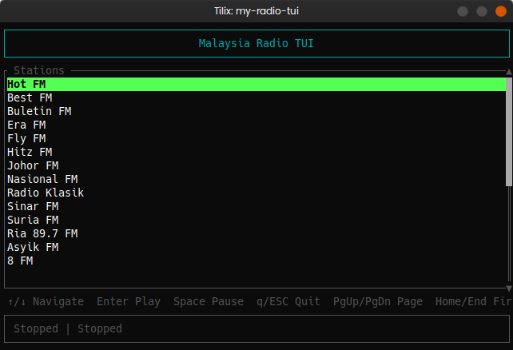

# My Radio TUI (Malaysia Radio)

A terminal-based radio player built with Rust using the ratatui library.

## Features

- Browse and play internet radio stations from an M3U8 playlist
- Keyboard navigation (Up/Down, PageUp/PageDown, Home/End)
- Play, pause, and stop stations
- Terminal UI with scrollable station list

## Screenshot



## Controls

| Key | Action |
|-----|--------|
| ↑/↓ | Navigate stations |
| PgUp/PgDn | Page navigation |
| Home/End | First/Last station |
| Enter | Play selected station |
| Space | Pause/Resume playback |
| q/ESC | Quit |

## Installation

```bash
# Build and install system-wide
sudo make install

# Or install in user's cargo bin
cargo install --path .
```

## Uninstallation

```bash
# Remove system-wide installation
sudo make uninstall

# Or use the uninstall script
./uninstall.sh

# Or uninstall from cargo
cargo uninstall my-radio-tui
```

## Usage

The application expects a playlist file at `playlist/malaysia-radio.m3u8`. After installation, the playlist is also available at `/usr/local/bin/playlist/malaysia-radio.m3u8`.

## Building

```bash
cargo build --release
./target/release/my-radio-tui
```

## Radio Stations

The application includes the following Malaysian radio stations:

- 8 FM
- Asyik FM
- Best FM
- Era FM
- Fly FM
- Hitz FM
- Hot FM
- Johor FM
- Kool FM
- Nasional FM
- Radio Klasik
- Ria FM
- Sinar FM
- Suria FM

## License

MIT
